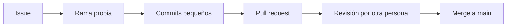

# Administración de Proyectos de Software

**UEA 1151055 · Trimestre 26-O (otoño 2026)**

Universidad Autónoma Metropolitana, Unidad Azcapotzalco · División de Ciencias Básicas e Ingeniería · Departamento de Sistemas

| | |
|---|---|
| **Alumno** | Max Uriel Sánchez Díaz |
| **Matrícula** | 2213026327 |
| **Licenciatura** | Ingeniería en Computación |
| **Profesor** | M. en C. Gabriel Hurtado Avilés |
| **Repositorio** | Individual, para las tareas de la UEA |

## Contenido

1. [Acerca de este repositorio](#acerca-de-este-repositorio)
2. [Tareas](#tareas)
3. [De qué trata la UEA](#de-qué-trata-la-uea)
4. [Evaluación](#evaluación)
5. [Reglas de entrega](#reglas-de-entrega)
6. [Cómo se trabaja un cambio](#cómo-se-trabaja-un-cambio)
7. [Entorno de trabajo](#entorno-de-trabajo)
8. [Estructura del repositorio](#estructura-del-repositorio)
9. [Bibliografía de la UEA](#bibliografía-de-la-uea)
10. [Licencia](#licencia)

---

## Acerca de este repositorio

Aquí entrego las tareas individuales de la UEA. Cada tarea tiene su carpeta (`tarea1/`, `tarea2/`, …) y su propio `README.md`, que es el documento de entrega; en la plataforma del curso sólo se registra la liga a esa carpeta.

Las prácticas de laboratorio y el proyecto integrador no van aquí: se trabajan en el repositorio del equipo.

## Tareas

| Tarea | Tema | Fecha límite |
|---|---|---|
| [Tarea 1](tarea1/) | Introducción a la administración de proyectos y entorno de trabajo: investigación (proyecto, marcos, herramientas y licencias), migración de un contenedor de PostgreSQL 17 a 18 y un segundo stack con MySQL y phpMyAdmin | Sábado 10 de octubre de 2026, 23:59 h |

## De qué trata la UEA

La UEA enseña a dirigir un proyecto de software de principio a fin: definir qué se va a construir, elegir el marco y el modelo de proceso con que se administra, organizar al equipo y a los interesados, y trabajar en un entorno reproducible donde cada decisión queda registrada.

El curso sigue un aprendizaje orientado a proyectos. Cada equipo administra un proyecto de software durante el trimestre y su repositorio concentra la evidencia. Dentro de la UEA, el **proyecto** es el trimestre del equipo, el **producto** es el sistema que vive en su repositorio y el **proceso** es el flujo issue, rama, Pull Request, integración continua y release.

### Unidad I. Introducción a la administración de proyectos

Semanas 1 a 3, del 17 de septiembre al 1 de octubre de 2026.

| Tema | Contenido |
|---|---|
| 1.1 Proyecto, producto y proceso | Qué es un proyecto según la Guía del PMBOK; operación continua frente a proyecto; el producto sigue vivo cuando el proyecto termina; alcance, tiempo, costo y calidad; ley de Brooks. |
| 1.2 Marcos de referencia: PMBOK, ISO 21500 y Scrum | Evolución de la Guía del PMBOK: procesos y áreas de conocimiento (6.ª ed.), principios y dominios de desempeño (7.ª ed.) y la 8.ª edición de 2025; las normas ISO 21500 e ISO 21502; responsabilidades, eventos y artefactos de Scrum, y cómo se combinan los tres marcos. |
| 1.3 Modelos del proceso de software | Modelo predictivo y la advertencia de Royce, incremental e iterativo, espiral de Boehm, Manifiesto Ágil y cómo elegir un modelo según la incertidumbre de requisitos y tecnología. |
| 1.4 Roles, interesados y causas documentadas de fracaso | Interesados internos y externos, matriz de poder e interés, roles del equipo y lo que reportan las organizaciones sobre por qué los proyectos no cumplen sus objetivos (PMI, 2018). |
| 1.5 Entorno de trabajo del equipo: Docker, Git y GitHub | Contenedores frente a máquinas virtuales; imagen, contenedor, volumen y puerto; Dockerfile, `compose.yaml` y comandos de Compose; áreas de Git, ramas, autenticación y el recorrido de un cambio en GitHub. |

### Lo que sigue

La Unidad II estudia el ciclo de vida de la administración de un proyecto: predictivo, adaptativo e híbrido, y cómo documentar la elección. Más adelante el curso retoma prácticas que atienden las causas de fracaso más citadas: historias de usuario con criterios de aceptación, estimación con planning poker, historial de velocidad y COCOMO II, matriz de probabilidad e impacto para los riesgos, control de cambios mediante Pull Requests y métricas del proyecto.

## Evaluación

| Rubro | Peso | Qué incluye |
|---|---|---|
| Evaluaciones periódicas | 40 % | Dos evaluaciones escritas con caso práctico: jueves 15 de octubre (unidades I y II) y jueves 19 de noviembre. |
| Tareas y prácticas de laboratorio | 30 % | Las tareas de este repositorio y tres prácticas: entorno con Docker, ramas protegidas con revisión por pares e integración continua con GitHub Actions. |
| Proyectos integradores | 30 % | Cada equipo administra un proyecto de software: tres entregas y una presentación final. |

La UEA admite evaluación de recuperación sin inscripción previa. Se sugiere al menos 80 % de asistencia para recibir retroalimentación sobre cada evaluación periódica.

## Reglas de entrega

- **Todo en GitHub.** Las evidencias viven en el repositorio; en la plataforma del curso sólo se registra la liga.
- **Documentación en Markdown.** `README.md` con portada, introducción, objetivos, desarrollo, conclusiones y referencias. No se aceptan Word ni PDF.
- **El historial es evidencia.** Se valora el trabajo incremental, con confirmaciones que digan qué se hizo.
- **Uso de IA declarado.** El uso de herramientas de inteligencia artificial se declara; lo no declarado se anula.
- **Entrega oportuna.** Reducción de 10 % por día, con demora máxima de diez días. Lo copiado se anula, tanto el original como las copias.

En los entregables del equipo, además, rige la puerta de calidad: un entregable cuenta sólo si llega por un Pull Request ligado a un issue, la integración continua termina sin fallas, lo aprueba una persona distinta de quien escribió el cambio y el sistema levanta con el comando de Docker Compose documentado en el README.

## Cómo se trabaja un cambio

Cualquier entrega del curso sigue el mismo recorrido:



1. **Issue:** se describe el trabajo y se liga a la entrega.
2. **Rama:** `git switch -c feat/nombre-corto`; nunca se trabaja directo en `main`.
3. **Commits:** pequeños y con intención, porque el historial es evidencia.
4. **Pull request:** se abre contra `main` y referencia el issue que atiende.
5. **Revisión:** la aprueba alguien distinto del autor.
6. **Merge:** al entrar, el issue se cierra y la rama se borra.

## Entorno de trabajo

| Herramienta | Para qué |
|---|---|
| Docker Desktop y Docker Compose | Levantar la aplicación y sus servicios igual en cada máquina. En Windows usa WSL 2. El comando es `docker compose`, con espacio. |
| Git | Control de versiones distribuido: commits, ramas e historial. |
| GitHub | Repositorio remoto, issues, Pull Requests, Projects y Actions. |
| VS Code, GitHub Desktop y DBeaver | Opcionales: editor, cliente visual de Git y cliente gráfico de bases de datos. |

Para revisar la Tarea 1 hay que tener Docker Desktop abierto y levantar cada stack desde su carpeta:

```bash
cd tarea1/postgres
docker compose up -d      # PostgreSQL 18 en 127.0.0.1:5434 y Adminer en http://localhost:8080
docker compose ps         # debe decir (healthy)
docker compose stop       # apagar
```

```bash
cd tarea1/mysql
docker compose up -d      # MySQL 9.7.2 en 127.0.0.1:3307 y phpMyAdmin en http://localhost:8081
```

Los detalles, las salidas y las capturas están en el [README de la Tarea 1](tarea1/README.md).

## Estructura del repositorio

```text
administracion_uam_a/
├── README.md          este documento
├── LICENSE            licencia MIT
├── .gitignore         data/, .env, Thumbs.db y .DS_Store
├── .gitattributes     finales de línea; LF para lo que corre en contenedores
└── tarea1/            Tarea 1
    ├── README.md      documento de entrega
    ├── img/           las ocho capturas
    ├── postgres/      PostgreSQL 18 + Adminer (en el historial, antes PostgreSQL 17)
    └── mysql/         MySQL 9.7 + phpMyAdmin
```

## Bibliografía de la UEA

Fuentes que usa el curso en la Unidad I.

Beck, K., et al. (2001). *Manifiesto por el desarrollo ágil de software*. https://agilemanifesto.org/iso/es/manifesto.html

Boehm, B. W. (1988). A spiral model of software development and enhancement. *Computer, 21*(5), 61–72.

Brooks, F. P. (1995). *The mythical man-month: Essays on software engineering* (ed. aniversario; 1.ª ed. 1975). Addison-Wesley.

Chacon, S., & Straub, B. (2014). *Pro Git* (2.ª ed.). Apress. https://git-scm.com/book/es/v2

Hurtado Avilés, G. (2026). *Planeación didáctica, trimestre 26-O: Administración de Proyectos de Software (1151055)*. UAM Azcapotzalco, División de CBI, Departamento de Sistemas.

International Organization for Standardization. (2020). *ISO 21502:2020 Project, programme and portfolio management — Guidance on project management*. https://www.iso.org/standard/74947.html

International Organization for Standardization. (2021). *ISO 21500:2021 Project, programme and portfolio management — Context and concepts*. https://www.iso.org/standard/75704.html

Pressman, R. S. (2009). *Software engineering: A practitioner's approach* (7.ª ed.). McGraw-Hill.

Project Management Institute. (2017). *A guide to the project management body of knowledge (PMBOK guide)* (6.ª ed.).

Project Management Institute. (2018). *Pulse of the profession 2018: Success in disruptive times*. https://www.pmi.org/-/media/pmi/documents/public/pdf/learning/thought-leadership/pulse/pulse-of-the-profession-2018.pdf

Project Management Institute. (2021). *A guide to the project management body of knowledge (PMBOK guide) and the standard for project management* (7.ª ed.).

Project Management Institute. (2025). *A guide to the project management body of knowledge (PMBOK guide) and the standard for project management* (8.ª ed.). https://www.pmi.org/standards/pmbok

Royce, W. W. (1970). Managing the development of large software systems. *Proceedings of IEEE WESCON*, 1–9.

Schwaber, K., & Sutherland, J. (2020). *La guía de Scrum*. https://scrumguides.org

Sommerville, I. (2004). *Ingeniería del software* (7.ª ed.). Addison Wesley.

## Licencia

El contenido de este repositorio se distribuye bajo la licencia MIT; el texto completo está en [LICENSE](LICENSE). Los materiales del curso (presentaciones, enunciados y archivos base) son de su autor.
