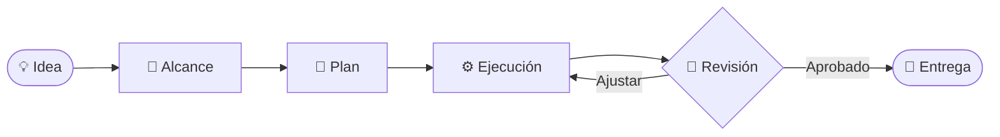

<div align="center">

# 🚀 Administración de Proyectos de Software

<p><strong>UEA · Universidad Autónoma Metropolitana · Unidad Azcapotzalco</strong></p>


</div>

---

## ✨ ¿De qué trata?

Esta UEA proporciona las herramientas y estrategias necesarias para **dirigir proyectos de software** de forma eficiente, desde la concepción de la idea hasta la entrega de valor. Aquí aprenderás a tomar decisiones, gestionar equipos y responder al cambio.

## 🎯 Objetivos de aprendizaje

| | Competencia |
|---|---|
| 🧭 | Definir alcance, objetivos y entregables claros |
| 📅 | Planear tiempos, recursos y presupuesto |
| 🤝 | Coordinar equipos y fomentar la colaboración |
| ⚠️ | Identificar, analizar y mitigar riesgos |
| ✅ | Medir la calidad y el avance del proyecto |

## 🧰 Temas principales

```text
┌─────────────────────────────────────────────────────────────┐
│  Inicio → Planeación → Ejecución → Monitoreo → Cierre      │
└─────────────────────────────────────────────────────────────┘
```

- **Metodologías:** Scrum, Kanban, enfoques ágiles y tradicionales.
- **Gestión:** alcance, cronograma, costos, calidad y comunicaciones.
- **Personas:** liderazgo, roles, negociación y trabajo colaborativo.
- **Control:** métricas, cambios, riesgos y lecciones aprendidas.

## 🗂️ Organización del repositorio

```text
📦 administracion_uam_a
 ├── 📚 materiales/       # Apuntes y recursos de la UEA
 ├── 📝 actividades/      # Ejercicios y entregas
 ├── 📊 proyectos/        # Evidencias y documentación
 └── 📖 README.md         # Guía del repositorio
```

## 🌱 Flujo de trabajo



## 💬 Frase guía

> “La gestión de proyectos no es hacer más cosas: es hacer las cosas correctas, en el momento correcto y con el equipo correcto.”

<div align="center">

### 🚀 ¡Planifiquemos el éxito, una iteración a la vez!


</div>
