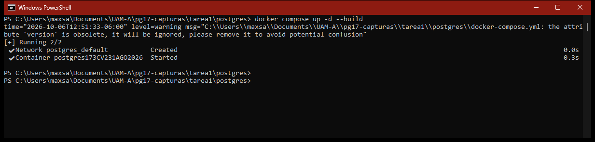
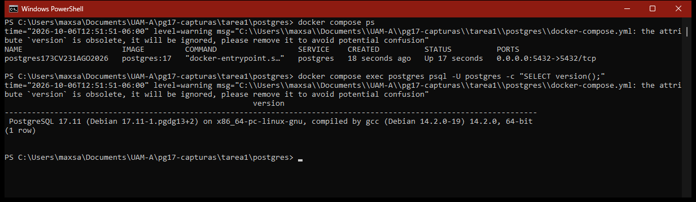
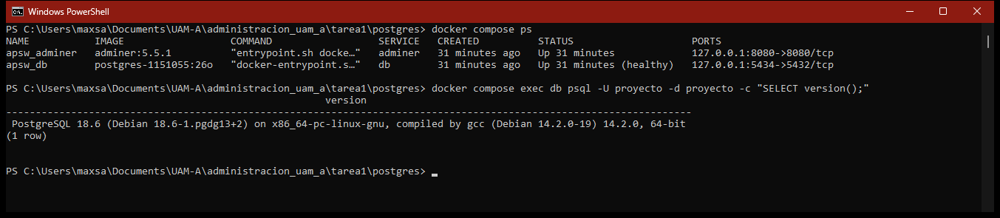
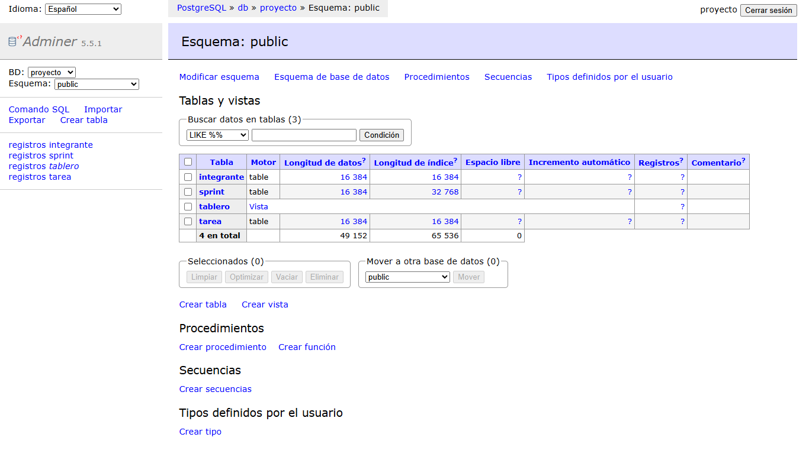
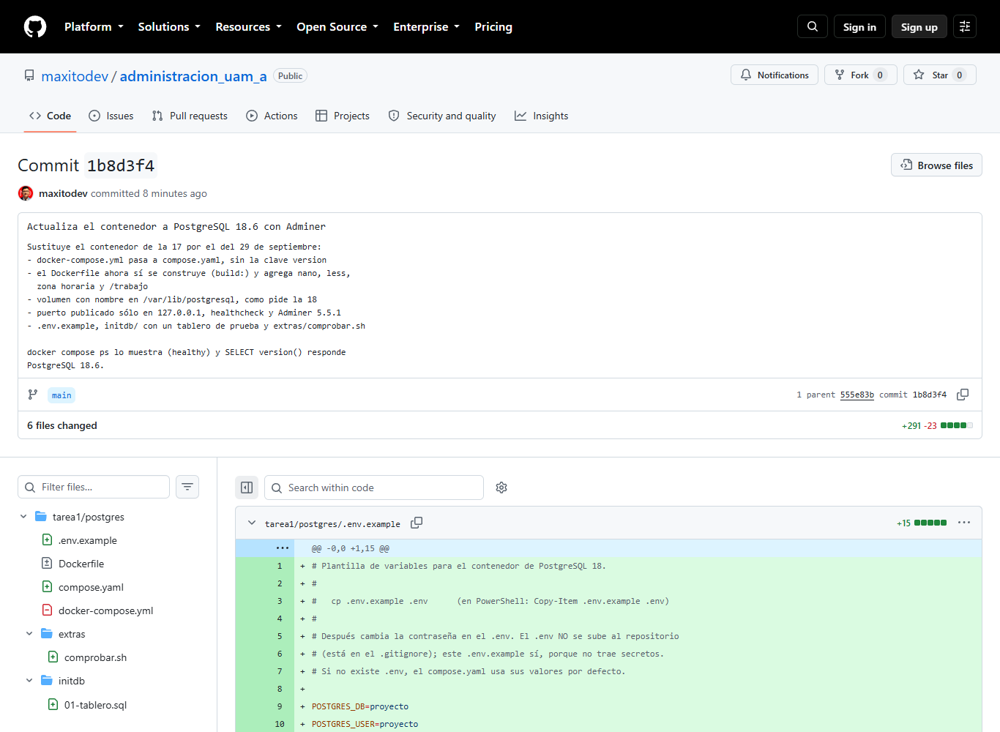
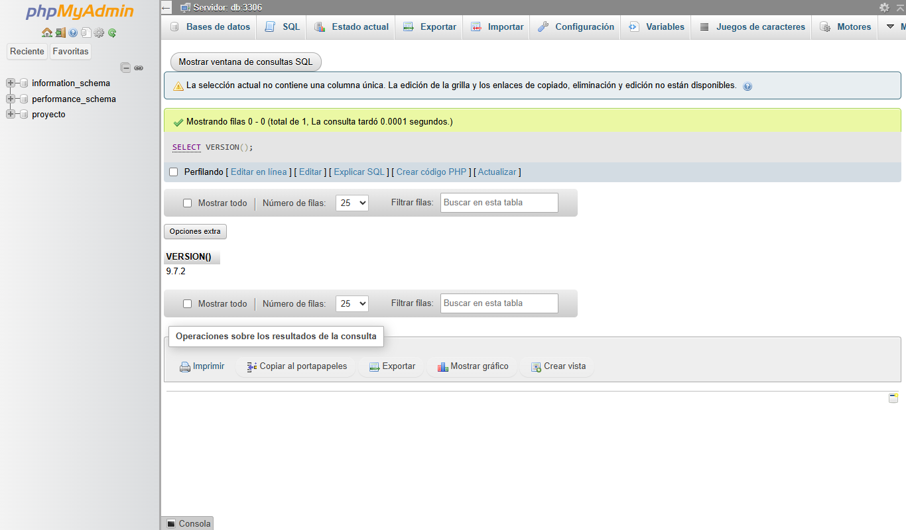
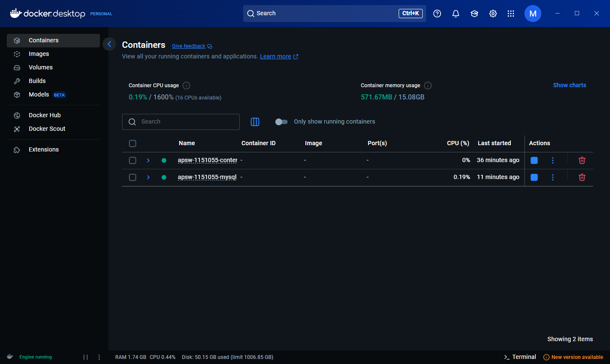
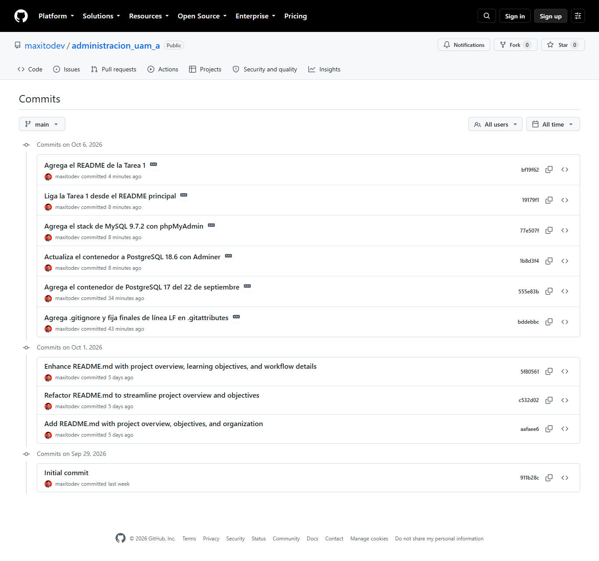

# Tarea 1 · Introducción a la administración de proyectos y entorno de trabajo

| | |
|---|---|
| **UEA y clave** | Administración de Proyectos de Software (1151055) |
| **Trimestre** | 26-O, otoño 2026 |
| **Licenciatura** | Ingeniería en Computación |
| **Nombre** | Max Uriel Sánchez Díaz |
| **Matrícula** | 2213026327 |
| **Profesor** | M. en C. Gabriel Hurtado Avilés |
| **Fecha** | 6 de octubre de 2026 |

Universidad Autónoma Metropolitana, Unidad Azcapotzalco · División de Ciencias Básicas e Ingeniería · Departamento de Sistemas

## Contenido

1. [Ejercicio 1. El repositorio](#ejercicio-1-el-repositorio)
2. [Ejercicio 2. Investigación](#ejercicio-2-investigación)
3. [Ejercicio 3. De PostgreSQL 17 a 18](#ejercicio-3-de-postgresql-17-a-18)
4. [Ejercicio 4. Otro stack: MySQL + phpMyAdmin](#ejercicio-4-otro-stack-mysql--phpmyadmin)
5. [Ejercicio 5. Capturas](#ejercicio-5-capturas)
6. [Uso de inteligencia artificial](#uso-de-inteligencia-artificial)
7. [Referencias](#referencias)

---

## Ejercicio 1. El repositorio

| Requisito | Dónde está |
|---|---|
| Repositorio público con licencia MIT | [github.com/maxitodev/administracion_uam_a](https://github.com/maxitodev/administracion_uam_a) · [LICENSE](../LICENSE) |
| `.gitignore` con `data/`, `.env`, `Thumbs.db` y `.DS_Store`, antes del Ejercicio 3 | [.gitignore](../.gitignore) |
| `.gitattributes` en la raíz | [.gitattributes](../.gitattributes) |
| Al menos cinco confirmaciones en días distintos | [Captura 8](#ejercicio-5-capturas) |
| README en la raíz con liga a cada tarea | [README.md](../README.md#tareas) |

El `.gitattributes` normaliza los finales de línea (`* text=auto`) y obliga a usar LF en `.sh`, `.sql`, `.yaml`, `Dockerfile` y `.env*`: esos archivos se leen dentro de contenedores Linux, y un script guardado con CRLF falla con `$'\r': command not found`.

```text
tarea1/
├── README.md
├── img/                  las ocho capturas
├── postgres/             PostgreSQL 18 + Adminer (antes, PostgreSQL 17)
│   ├── Dockerfile
│   ├── compose.yaml
│   ├── .env.example
│   ├── initdb/01-tablero.sql
│   └── extras/comprobar.sh
└── mysql/                MySQL 9.7 + phpMyAdmin
    └── compose.yaml
```

---

## Ejercicio 2. Investigación

### 1. ¿Qué es un proyecto de software?

Un proyecto es un trabajo temporal, con inicio y fin, que busca crear un producto, servicio o resultado único (Project Management Institute [PMI], 2021). Si el trabajo se repite, ya no es un proyecto sino una operación (Lewis, 2007).

- **Proyecto:** desarrollar en un trimestre una app de horarios. Termina al liberar la versión 1.0.
- **Operación:** el soporte diario de esa app en producción: respaldos, altas de usuarios y parches. Dura mientras el sistema se use.

| Concepto | Qué es | Ejemplo |
|---|---|---|
| Producto | El software que se entrega, con su documentación (Sommerville, 2004/2005) | La app de horarios |
| Proceso | Las actividades con las que se produce: especificación, diseño, implementación, validación y evolución (Sommerville, 2004/2005) | Cascada o desarrollo evolutivo |
| Proyecto | El trabajo temporal, con fechas, presupuesto y alcance, para crear o mejorar un producto | «App de horarios v1.0, trimestre 26-O» |

**Alcance, tiempo, costo y calidad.** Alcance son las funciones que incluye el proyecto, tiempo es el plazo, costo es el presupuesto (casi siempre horas de trabajo) y calidad es qué tanto se cumplen los requisitos (PMI, 2021). Forman el triángulo de hierro, aunque no hay una sola versión: en la literatura tiempo y costo aparecen siempre, y el tercer vértice cambia según el autor (Pollack et al., 2018). Si se mueve uno, los otros se ajustan. Cuando el plazo aprieta, lo que más se sacrifica suele ser la calidad (Lewis, 2007).

*Ejemplo.* La app se planeó con ocho funciones, diez semanas y tres desarrolladores. A la mitad piden avisos de cambio de salón. Se puede pedir más tiempo, sumar a alguien (costo) o quitar otra función (alcance). Si nada de eso se acepta, se recortan pruebas y revisiones, y la app sale con más errores.

### 2. ¿Cómo se administra?

**PMBOK.** La 6.ª edición se organizaba en 49 procesos, 5 grupos de procesos y 10 áreas de conocimiento. La 7.ª (2021) cambió a 12 principios y 8 dominios de desempeño, y pide adaptar el enfoque (predictivo, adaptativo o híbrido) a cada proyecto (PMI, 2021). La 8.ª, de 2025, reduce los principios a seis y reintroduce los procesos como «áreas de enfoque» (PMI, 2025). Aquí uso la 7.ª, que es la de las referencias del curso.

**Scrum.** Marco ligero basado en transparencia, inspección y adaptación (Schwaber & Sutherland, 2020):

- **3 responsabilidades:** Product Owner, Scrum Master y Developers.
- **5 eventos:** el Sprint (un mes o menos), que contiene a Sprint Planning, Daily Scrum, Sprint Review y Sprint Retrospective.
- **3 artefactos:** Product Backlog, Sprint Backlog e Increment.

| Criterio | Predictivo | Iterativo | Ágil |
|---|---|---|---|
| Alcance | Se fija al inicio; cambia solo con control formal | Aproximado al inicio, se precisa en cada iteración | Se fija solo para el ciclo en curso |
| Entregas | Normalmente una, al final | Versiones intermedias para revisión | Un incremento utilizable por ciclo |
| Cambio | Caro, requiere aprobación | Se incorpora en la siguiente iteración | Se espera y se reprioriza |
| Cliente | Al inicio y al final | En cada revisión | Continua |

*Nota.* Elaboración propia con base en Sommerville (2004/2005), PMI (2021), Beck et al. (2001) y Schwaber y Sutherland (2020).

**Mi elección para el proyecto del curso:** Scrum adaptado con tablero Kanban, precedido de una planeación inicial corta. Razones:

1. La fecha es fija y el alcance flexible, justo lo que Scrum maneja con un backlog ordenado por valor.
2. Hay incertidumbre técnica al inicio, y el PMI (2021) recomienda enfoques adaptativos en ese caso.
3. GitHub Projects ofrece tablero kanban e iteraciones ligados a issues y pull requests (GitHub, Inc., s. f.-a).

Plan: semana 1 de planeación; semanas 2 a 11 en cinco sprints de dos semanas; tablero con *Por hacer*, *En curso*, *En revisión* y *Hecho*, con un máximo de dos tareas por persona (Coleman & Vacanti, 2025). Definición de Terminado: pull request revisado, pruebas que pasan, aplicación que levanta en su contenedor y README al día.

### 3. ¿Con qué herramientas?

- **Git y GitHub.** Git registra cada cambio, y con eso se puede volver a un estado anterior y saber quién cambió qué y cuándo (Chacon & Straub, 2014). GitHub hospeda el repositorio y agrega *issues* y *pull requests* para el trabajo en equipo (GitHub, Inc., s. f.-b).
- **Kanban.** Cada tarea es una tarjeta que avanza por columnas; permite ver qué está atorado y limitar el trabajo en curso (Coleman & Vacanti, 2025). GitHub Projects y Trello lo ofrecen.
- **Contenedores.** Empaquetan la aplicación con lo que necesita para ejecutarse, de modo que se comporta igual en cualquier máquina (Docker, Inc., s. f.-c).
- **GitHub Actions.** Corre pruebas y otras tareas automáticas con cada *push* o pull request, así que un cambio que rompe algo se detecta de inmediato (GitHub, Inc., s. f.-c).

**Docker frente a una máquina virtual**

| Criterio | Contenedor | Máquina virtual |
|---|---|---|
| Qué virtualiza | El sistema operativo | El hardware, mediante un hipervisor |
| Kernel | Comparte el del anfitrión | Cada VM trae el suyo |
| Peso | Ligero (las imágenes de esta tarea miden de 116 MB a 934 MB en disco) | Decenas de GB, por el SO completo |
| Arranque | Rápido | Más lento: arranca un SO completo |
| Aislamiento | Procesos aislados sobre el mismo kernel | Sistema completo con kernel propio |

*Nota.* Elaboración propia con datos de Docker, Inc. (s. f.-d).

**Dockerfile frente a compose.yaml**

| Aspecto | Dockerfile | compose.yaml |
|---|---|---|
| Qué es | La receta para construir **una** imagen (Docker, Inc., s. f.-a) | La descripción de una aplicación de **varios** contenedores: servicios, redes y volúmenes (Compose Specification, s. f.) |
| Se usa con | `docker build` o la clave `build:` | `docker compose up`, `down`, `ps`, etc. |
| En esta tarea | `FROM postgres:18.6`, instala `nano` y `less`, define `LANG`, `TZ` y `WORKDIR /trabajo` | Servicios `db` y `adminer`, volumen `datos_db`, proyecto `apsw-1151055-contenedor` |

El archivo preferido es `compose.yaml`; `docker-compose.yml` sigue funcionando por compatibilidad. La clave `version:` es obsoleta: Compose V2 la ignora y solo avisa (Compose Specification, s. f.).

**Volúmenes.** Lo que un contenedor escribe en su capa interna se pierde al borrarlo; un volumen guarda los datos aparte (Docker, Inc., s. f.-b). Se usan dos tipos:

- **Volumen con nombre:** lo administra Docker. `datos_db:/var/lib/postgresql` guarda la base. Desde PostgreSQL 18 se monta esa ruta y no `/var/lib/postgresql/data` (PostgreSQL Docker Community, s. f.).
- **Bind mount:** monta una carpeta del anfitrión. `./initdb:/docker-entrypoint-initdb.d:ro` entrega los scripts de inicio (solo corren con el directorio de datos vacío) y `./:/trabajo` comparte el proyecto.

**Comandos de Docker Compose** (en `tarea1/postgres/`)

| Comando | Qué hace |
|---|---|
| `docker compose up -d` | Construye si hace falta, crea y arranca los contenedores en segundo plano |
| `docker compose exec db psql -U proyecto -d proyecto` | Ejecuta un comando dentro de un contenedor en marcha |
| `docker compose stop` | Detiene los contenedores sin eliminarlos |
| `docker compose down` | Detiene y elimina contenedores y red; conserva los volúmenes |
| `docker compose down -v` | Además borra los volúmenes; el siguiente `up` empieza desde cero y vuelve a correr `initdb/` |
| `docker compose ps` | Lista los contenedores del proyecto con su estado y puertos |
| `docker compose logs db` | Muestra la salida del contenedor, útil para ver errores al arrancar |

### 4. ¿Bajo qué licencia se distribuye el software?

Una licencia dice qué puede hacer con el programa quien lo recibe y qué obligaciones adquiere. Sin licencia aplican los derechos de autor exclusivos: nadie puede copiarlo ni modificarlo, aunque el repositorio sea público (GitHub, Inc., s. f.-d).

**Los dos tipos.** Las **permisivas** (MIT, BSD, Apache 2.0) piden poco, en esencia conservar el aviso de copyright, y permiten distribuir versiones derivadas con otra licencia. El **copyleft** (GPL, LGPL, AGPL) exige que las versiones distribuidas mantengan la misma licencia y entreguen el código fuente (Free Software Foundation [FSF], 1991; GitHub, Inc., s. f.-e).

| Licencia | Tipo | Misma licencia en derivados | Publicar código fuente | ¿Se puede usar en software cerrado? |
|---|---|---|---|---|
| MIT | Permisiva | No | No | Sí |
| BSD 3-Clause | Permisiva | No | No | Sí |
| Apache 2.0 | Permisiva (con licencia expresa de patentes) | No | No | Sí |
| GPLv3 | Copyleft fuerte | Sí, también obras que lo incorporen | Sí, al distribuir | No para distribuirlo; en privado sí |
| LGPLv3 | Copyleft débil | Solo la biblioteca y sus cambios | Sí, de la biblioteca | Con condiciones: puede usarla por sus interfaces si el usuario puede cambiarla |
| AGPLv3 | Copyleft de red | Sí | Sí, también al ofrecerlo como servicio por red | No |

*Nota.* Elaboración propia con base en GitHub, Inc. (s. f.-e) y FSF (1991).

**Mi elección: MIT.** Es un repositorio escolar y quiero que cualquiera (compañeros, alumnos de otros trimestres o yo mismo) pueda reutilizar los archivos sin pedir permiso. La MIT se lee en un minuto, solo pide conservar el aviso y es compatible con casi todo (Open Source Initiative [OSI], s. f.). Su desventaja es que alguien podría cerrar mi código, algo que en un repositorio de tareas no me preocupa. Con GPL, quien distribuyera una versión modificada tendría que publicarla también bajo GPL.

**Caso real: MySQL, Oracle y MariaDB.** MySQL AB publicó MySQL bajo la GPL desde 2000 y vendía licencias comerciales a quien lo quería integrar en productos cerrados (Buytaert, 2010). Oracle sigue con el mismo esquema (GPLv2 más licencia comercial).

| Fecha | Hecho |
|---|---|
| Enero de 2008 | Sun anuncia que comprará MySQL AB por unos 1,000 millones de dólares (Kirk, 2008). |
| Abril de 2009 | Oracle anuncia que comprará Sun por unos 7,400 millones de dólares (Oracle Corporation & Sun Microsystems, 2009). |
| 2009 | Michael «Monty» Widenius, fundador de MySQL, crea el fork MariaDB porque desconfía de cómo manejará Oracle el proyecto (MariaDB Foundation, s. f.). |
| Enero de 2010 | Oracle concluye la compra de Sun y pasa a controlar MySQL (Oracle Corporation, 2010). |
| 2013 | Wikipedia migra a MariaDB (Feldman, 2013); Fedora y Red Hat anuncian el cambio (Fedora Project, s. f.). |
| Junio de 2017 | Debian 9 sale con MariaDB como única variante de MySQL (Kekäläinen, 2017). |

**La clave: la GPLv2 ya le daba a cualquiera que recibiera el código el derecho de copiarlo, modificarlo y redistribuirlo, con la sola condición de mantener la misma licencia, y no prevé que el titular retire esos permisos.** Por eso Widenius pudo crear MariaDB sin pedirle permiso a Oracle (FSF, 1991, secciones 2, 4 y 6). A cambio, MariaDB Server debe seguir bajo GPLv2.

---

## Ejercicio 3. De PostgreSQL 17 a 18

Todo se hizo en `tarea1/postgres/`, en dos confirmaciones:

1. **«Agrega el contenedor de PostgreSQL 17 del 22 de septiembre».** El `Dockerfile` y el `docker-compose.yml` del material, sin cambios.
2. **«Actualiza el contenedor a PostgreSQL 18.6 con Adminer».** Se apagó la 17 con `docker compose down`, se borró `docker-compose.yml` y se puso el `Dockerfile` y el `compose.yaml` del material, junto con `.env.example`, `initdb/01-tablero.sql` y `extras/comprobar.sh`.

**PostgreSQL 17**

```console
> docker compose up -d --build
time="2026-10-06T12:19:23-06:00" level=warning msg="...\\tarea1\\postgres\\docker-compose.yml: the attribute `version` is obsolete, it will be ignored, please remove it to avoid potential confusion"
 postgres Pulling
 ...
 postgres Pulled
 Network postgres_default  Created
 Container postgres173CV231AGO2026  Created
 Container postgres173CV231AGO2026  Started

> docker compose ps
NAME                      IMAGE         COMMAND                  SERVICE    CREATED          STATUS          PORTS
postgres173CV231AGO2026   postgres:17   "docker-entrypoint.s…"   postgres   13 seconds ago   Up 12 seconds   0.0.0.0:5432->5432/tcp

> docker compose exec postgres psql -U postgres -c "SELECT version();"
                                                       version
----------------------------------------------------------------------------------------------------------------------
 PostgreSQL 17.11 (Debian 17.11-1.pgdg13+2) on x86_64-pc-linux-gnu, compiled by gcc (Debian 14.2.0-19) 14.2.0, 64-bit
(1 row)
```

**PostgreSQL 18**

```console
> docker compose up -d --build
 ...
 #7 [db 3/3] WORKDIR /trabajo
 #8 naming to docker.io/library/postgres-1151055:26o done
 db  Built
 Network apsw-1151055-contenedor_default  Created
 Volume "apsw-1151055-contenedor_datos_db"  Created
 Container apsw_db  Started
 Container apsw_db  Healthy
 Container apsw_adminer  Started

> docker compose ps
NAME           IMAGE                  COMMAND                  SERVICE   CREATED          STATUS                    PORTS
apsw_adminer   adminer:5.5.1          "entrypoint.sh docke…"   adminer   11 seconds ago   Up 5 seconds              127.0.0.1:8080->8080/tcp
apsw_db        postgres-1151055:26o   "docker-entrypoint.s…"   db        11 seconds ago   Up 10 seconds (healthy)   127.0.0.1:5434->5432/tcp

> docker compose exec db psql -U proyecto -d proyecto -c "SELECT version();"
                                                      version
--------------------------------------------------------------------------------------------------------------------
 PostgreSQL 18.6 (Debian 18.6-1.pgdg13+2) on x86_64-pc-linux-gnu, compiled by gcc (Debian 14.2.0-19) 14.2.0, 64-bit
(1 row)

> docker compose exec db bash
root@...:/trabajo# bash extras/comprobar.sh
...
Resultado: 15 OK, 0 FALLA
```

`extras/comprobar.sh` revisa desde dentro del contenedor que el servidor responda, que la versión mayor sea 18, que la base use UTF8 y colación C, que la hora sea la de la Ciudad de México, que existan las tablas de `initdb/` y que estén `nano`, `less` y la carpeta `/trabajo`. Adminer queda en <http://localhost:8080>: hay que elegir **PostgreSQL** en *Motor de base de datos*, servidor `db`, usuario y base `proyecto`, contraseña `practica_local_26o`.

### Diferencias entre los dos contenedores

| Aspecto | PostgreSQL 17 (22 sept) | PostgreSQL 18 (29 sept) | Por qué cambió |
|---|---|---|---|
| Archivo | `docker-compose.yml` | `compose.yaml` | Es el nombre que recomienda la Compose Specification. |
| Clave `version:` | `'3.8'` | No existe | Está obsoleta y Compose V2 avisa al levantar. |
| Nombre del proyecto | El de la carpeta | `name: apsw-1151055-contenedor` | El nombre de la carpeta cambia entre computadoras. |
| Servicio y contenedor | `postgres` / `postgres173CV231AGO2026` | `db` / `apsw_db` | Nombres cortos y estables. |
| Imagen | `image: postgres:17` (etiqueta flotante) | `build: .` + `FROM postgres:18.6` | Versión exacta y repetible; el Dockerfile ahora sí se usa. |
| Dockerfile | `FROM postgres:17` y `EXPOSE 5432` | Versión fija, `nano`, `less`, `LANG`, `TZ`, `WORKDIR /trabajo` | Agrega lo que el curso necesita. |
| Credenciales | Fijas | `${POSTGRES_USER:-proyecto}` y similares, con `.env` opcional | Permite no versionar contraseñas reales. |
| Codificación | La de la imagen | `--encoding=UTF8 --locale=C` | Que todos ordenen los textos igual. |
| Puerto | `5432:5432` (visible en la red local) | `127.0.0.1:5434:5432` | Solo esta máquina se conecta, sin chocar con un PostgreSQL local. |
| Datos | Bind mount `./data` | Volumen `datos_db:/var/lib/postgresql` | La imagen 18 cambió la ruta de `PGDATA`. |
| Scripts de inicio | No había | `./initdb` en solo lectura | Crea tablas de prueba la primera vez. |
| Carpeta de trabajo | No había | `./:/trabajo` | Los mismos archivos dentro y fuera del contenedor. |
| Healthcheck | No había | `pg_isready` | `ps` muestra `(healthy)` y Adminer espera a la base. |
| Interfaz web | No había | Adminer 5.5.1 | Ver la base sin instalar nada. |

### ¿Se usaba el Dockerfile viejo?

No. El `docker-compose.yml` del 22 de septiembre tiene `image: postgres:17` y no tiene `build:`, y Compose solo construye los servicios que llevan `build:`. Se ve en la salida: dice `postgres Pulling` / `Pulled` sin ningún paso de construcción, y `docker compose ps` muestra la imagen oficial `postgres:17`. Tampoco habría cambiado nada, porque el Dockerfile viejo solo tenía `FROM` y `EXPOSE 5432`, y la imagen oficial ya expone ese puerto. En el contenedor nuevo sí se usa: la salida dice `db Built` y la imagen es `postgres-1151055:26o`.

### Versionado semántico y por qué de 17 a 18 es un cambio mayor

SemVer escribe las versiones como MAYOR.MENOR.PARCHE: el parche corrige errores, la menor agrega funciones compatibles y la mayor rompe la compatibilidad (Preston-Werner, s. f.). Fijar la versión exacta de cada componente es parte de la gestión de configuración (Pressman, 2009).

PostgreSQL no usa SemVer, pero desde la 10 su primer número es la versión mayor y el segundo solo trae correcciones (PostgreSQL Global Development Group [PGDG], s. f.-b). Pasar de 17 a 18 es un cambio mayor porque:

1. **Cambia el formato de los datos.** Un directorio creado por la 17 no lo abre la 18; hay que migrarlo con volcado y restauración o con `pg_upgrade` (PGDG, s. f.-b).
2. **Cambia la imagen de Docker.** Desde la 18, `PGDATA` es `/var/lib/postgresql/18/docker` y el volumen se monta en `/var/lib/postgresql` (PostgreSQL Docker Community, s. f.). Lo probé con la ruta vieja: el contenedor termina con código 1.
3. **Cambia un valor por defecto.** `initdb` activa las sumas de verificación de datos (`SHOW data_checksums;` responde `on`), y `pg_upgrade` exige que ambos clústeres coincidan (PGDG, 2025).

La 18.6 salió el 13 de agosto de 2026 (PGDG, 2026) y la serie 18 tiene soporte hasta el 14 de noviembre de 2030 (PGDG, s. f.-b). Al fijar `postgres:18.6`, el número mayor dice qué migración hizo falta y el menor qué correcciones trae.

---

## Ejercicio 4. Otro stack: MySQL + phpMyAdmin

En `tarea1/mysql/` está el `compose.yaml`: tiene la misma forma que el de PostgreSQL 18, traducido a MySQL. Usa la imagen oficial sin Dockerfile, así que solo lleva `image:`.

```console
> docker compose up -d
 phpmyadmin Pulled
 db Pulled
 Network apsw-1151055-mysql_default  Created
 Volume "apsw-1151055-mysql_datos_mysql"  Created
 Container apsw_mysql  Started
 Container apsw_mysql  Healthy
 Container apsw_phpmyadmin  Started

> docker compose ps
NAME              IMAGE              COMMAND                  SERVICE      CREATED          STATUS                    PORTS
apsw_mysql        mysql:9.7.2        "docker-entrypoint.s…"   db           20 seconds ago   Up 17 seconds (healthy)   33060/tcp, 127.0.0.1:3307->3306/tcp
apsw_phpmyadmin   phpmyadmin:5.2.3   "/docker-entrypoint.…"   phpmyadmin   17 seconds ago   Up 6 seconds              127.0.0.1:8081->80/tcp

> docker compose exec -T -e MYSQL_PWD=practica_local_26o db mysql -u proyecto proyecto -e "SELECT VERSION(); SELECT @@character_set_server, @@collation_server, @@version_comment;"
VERSION()
9.7.2
@@character_set_server	@@collation_server	@@version_comment
utf8mb4	utf8mb4_0900_ai_ci	MySQL Community Server - GPL
```

phpMyAdmin queda en <http://localhost:8081> (usuario `proyecto`, contraseña `practica_local_26o`). MySQL se publica en el **3307** porque en mi computadora el 3306 lo ocupa un MySQL 8.4 instalado en Windows, y phpMyAdmin usa el **8081** para poder tener los dos stacks encendidos junto a Adminer (8080).

### Equivalencias usadas

Con base en la documentación de las imágenes oficiales (Docker Community & MySQL Team, s. f.; PostgreSQL Docker Community, s. f.).

| Concepto | PostgreSQL 18 + Adminer | MySQL 9.7 + phpMyAdmin |
|---|---|---|
| Imagen | `build: .` + `postgres-1151055:26o` | `image: mysql:9.7.2` |
| Base, usuario y contraseña | `POSTGRES_DB`, `POSTGRES_USER`, `POSTGRES_PASSWORD` | `MYSQL_DATABASE`, `MYSQL_USER`, `MYSQL_PASSWORD` |
| Superusuario | El propio `POSTGRES_USER` | `MYSQL_ROOT_PASSWORD` (obligatoria) |
| Codificación | `POSTGRES_INITDB_ARGS: "--encoding=UTF8 --locale=C"` | `command: --character-set-server=utf8mb4 --collation-server=utf8mb4_0900_ai_ci` |
| Puerto del motor | `127.0.0.1:5434:5432` | `127.0.0.1:3307:3306` |
| Datos | `datos_db:/var/lib/postgresql` | `datos_mysql:/var/lib/mysql` |
| Healthcheck | `pg_isready` | `mysqladmin ping -h 127.0.0.1 --silent` |
| Interfaz web | `adminer:5.5.1` en el 8080 | `phpmyadmin:5.2.3` en el 8081 (corre sobre Apache, puerto 80) |
| Servidor por defecto | `ADMINER_DEFAULT_SERVER: db` | `PMA_HOST: db` |

Las colaciones no ordenan igual: `C` compara bytes y distingue mayúsculas y acentos, mientras que `utf8mb4_0900_ai_ci` no distingue ninguno de los dos.

**El healthcheck de MySQL.** `mysqladmin ping` regresa 0 si el servidor está corriendo aunque rechace la conexión, así que no necesita usuario ni contraseña. Se usa `-h 127.0.0.1` para forzar TCP: mientras inicializa, la imagen levanta un servidor temporal que solo atiende por socket (docker-library, s. f.), y por TCP la prueba pasa solo cuando ya arrancó el servidor definitivo. Así phpMyAdmin no intenta conectarse antes de tiempo.

### PostgreSQL + Adminer frente a MySQL + phpMyAdmin

| Aspecto | PostgreSQL + Adminer | MySQL + phpMyAdmin |
|---|---|---|
| Motor y versión | PostgreSQL 18.6 | MySQL Community Server 9.7.2 (LTS) |
| Licencia del motor | PostgreSQL License, permisiva (PGDG, s. f.-a) | GPLv2 (el servidor se identifica como `MySQL Community Server - GPL`) |
| Quién está detrás | Una comunidad (PGDG) | Oracle Corporation |
| Puerto | 5432 | 3306 |
| Cliente de línea de comandos | `psql` | `mysql` |
| Interfaz web | Adminer: un solo archivo PHP que maneja varios motores (Vrána, s. f.); por eso al entrar hay que elegir el motor | phpMyAdmin: aplicación PHP solo para MySQL y MariaDB (phpMyAdmin, s. f.) |
| Espacio en disco (`docker image ls`) | 461 MB + 116 MB | 934 MB + 575 MB |
| Cuándo lo usaría | Cuando quiero una licencia permisiva y una interfaz ligera | Cuando el proyecto ya usa MySQL |

La última fila es mi opinión.

### LTS, innovation y por qué `mysql:9.7.2`

Desde MySQL 8.1.0 (julio de 2023), Oracle publica dos líneas: LTS e *Innovation* (Gryp & Lastori, 2023).

| Aspecto | LTS | Innovation |
|---|---|---|
| Qué cambia | Solo las correcciones necesarias | Funciones nuevas y eliminación de lo obsoleto |
| Frecuencia | Una serie nueva cada dos años aproximadamente | Una versión cada trimestre aproximadamente |
| Soporte | 5 años Premier y 3 extendido | Hasta que sale la siguiente Innovation |
| Para quién | Sistemas que necesitan estabilidad | Equipos que quieren lo más nuevo y tienen pruebas automatizadas |

*Nota.* Elaboración propia con base en Gryp y Lastori (2023) y Oracle Corporation (s. f.).

Hoy hay dos series LTS: la 8.4 y la 9.7, que salió el 21 de abril de 2026 (Oracle Corporation, s. f.). Al 6 de octubre de 2026, en Docker Hub las etiquetas `latest` e `innovation` apuntan a MySQL 26.7.0 (Innovation) y la etiqueta `lts` apunta a la 9.7.2 (Docker Community & MySQL Team, s. f.). Por eso se fija `mysql:9.7.2` y no `mysql:latest`:

1. **Reproducibilidad.** Una etiqueta como `latest` cambia sin aviso; con `9.7.2` todos descargan el mismo motor.
2. **Línea base.** Una Innovation puede quitar funciones, y un script podría funcionar en una máquina y fallar en otra. Fijar la versión crea un punto de referencia que solo se cambia de forma controlada (Pressman, 2009).
3. **Soporte largo.** La serie 9.7 tiene 5 años de soporte Premier y 3 extendido.

Es lo mismo que se hizo con `postgres:18.6` y que no se hacía con `postgres:17`.

---

## Ejercicio 5. Capturas

**1. PostgreSQL 17: `docker compose up -d --build` con el aviso de `version`**



**2. PostgreSQL 17: `docker compose ps` y `SELECT version();`**



Las capturas 1 y 2 se tomaron con el commit de PostgreSQL 17 en una carpeta aparte (`git worktree add ..\pg17-capturas 555e83b`), porque en `tarea1/postgres/` ya está el contenedor de la 18.

**3. PostgreSQL 18: `docker compose ps` con `(healthy)` y `SELECT version();`**



**4. PostgreSQL 18: Adminer con las tablas**



**5. El diff de la confirmación a la 18, en GitHub**



**6. phpMyAdmin con `SELECT VERSION();`**



**7. Docker Desktop con los dos stacks encendidos**



**8. El historial de confirmaciones en GitHub**



---

## Uso de inteligencia artificial

Usé un asistente de inteligencia artificial de forma puntual: para revisar la redacción del texto y como apoyo para escribir `initdb/01-tablero.sql`, `extras/comprobar.sh` y `.env.example` a partir de los archivos del material. El `Dockerfile` y el `docker-compose.yml` de PostgreSQL 17, y el `Dockerfile` y el `compose.yaml` de PostgreSQL 18, son los del material del curso, sin cambios.

---

## Referencias

Beck, K., Beedle, M., van Bennekum, A., Cockburn, A., Cunningham, W., Fowler, M., Grenning, J., Highsmith, J., Hunt, A., Jeffries, R., Kern, J., Marick, B., Martin, R. C., Mellor, S., Schwaber, K., Sutherland, J., & Thomas, D. (2001). *Manifiesto por el desarrollo ágil de software*. https://agilemanifesto.org/iso/es/manifesto.html

Buytaert, D. (2010, 8 de marzo). The history of MySQL AB. *Dries Buytaert*. https://dri.es/the-history-of-mysql-ab

Chacon, S., & Straub, B. (2014). *Pro Git* (2.ª ed.). Apress. https://git-scm.com/book/es/v2

Coleman, J., & Vacanti, D. (2025). *La guía Kanban* (A. Fernández-Ceballos, Trad.; versión 2025.5). Kanban Guides. https://kanbanguides.org/es-es/the-kanban-guide/2025.5/

Compose Specification. (s. f.). *The Compose Specification*. GitHub. https://github.com/compose-spec/compose-spec/blob/main/spec.md

Docker Community & MySQL Team. (s. f.). *mysql - Official image*. Docker Hub. https://hub.docker.com/_/mysql

Docker, Inc. (s. f.-a). *Dockerfile reference*. Docker Docs. https://docs.docker.com/reference/dockerfile/

Docker, Inc. (s. f.-b). *Volumes*. Docker Docs. https://docs.docker.com/engine/storage/volumes/

Docker, Inc. (s. f.-c). *What is a container?* https://www.docker.com/resources/what-container/

docker-library. (s. f.). *docker-entrypoint.sh (imagen mysql)* [Código fuente]. GitHub. https://github.com/docker-library/mysql/blob/master/docker-entrypoint.sh

Fedora Project. (s. f.). *Features/ReplaceMySQLwithMariaDB*. Fedora Project Wiki. https://fedoraproject.org/wiki/Features/ReplaceMySQLwithMariaDB

Feldman, A. (2013, 22 de abril). Wikipedia adopts MariaDB. *Diff*. https://diff.wikimedia.org/2013/04/22/wikipedia-adopts-mariadb/

Free Software Foundation. (1991). *GNU General Public License version 2*. Open Source Initiative. https://opensource.org/license/gpl-2-0

GitHub, Inc. (s. f.-a). *Acerca de Projects*. Documentación de GitHub. https://docs.github.com/es/issues/planning-and-tracking-with-projects/learning-about-projects/about-projects

GitHub, Inc. (s. f.-b). *¿Qué es GitHub?* Documentación de GitHub. https://docs.github.com/es/get-started/start-your-journey/what-is-github

GitHub, Inc. (s. f.-c). *Descripción de Acciones de GitHub*. Documentación de GitHub. https://docs.github.com/es/actions/get-started/understand-github-actions

GitHub, Inc. (s. f.-d). *No license*. Choose a License. https://choosealicense.com/no-permission/

GitHub, Inc. (s. f.-e). *Licenses*. Choose a License. https://choosealicense.com/licenses/

Gryp, K., & Lastori, A. (2023, 18 de julio). Introducing MySQL Innovation and Long-Term Support (LTS) versions. *MySQL Blog Archive*. https://dev.mysql.com/blog-archive/introducing-mysql-innovation-and-long-term-support-lts-versions/

Kekäläinen, O. (2017, 18 de junio). Debian 9 released with MariaDB as the only MySQL variant. *MariaDB.org*. https://mariadb.org/debian-9-released-mariadb-mysql-variant/

Kirk, J. (2008, 16 de enero). Update: Sun to acquire MySQL for $1B. *Computerworld*. https://www.computerworld.com/article/1579016/update-sun-to-acquire-mysql-for-1b.html

Lewis, J. P. (2007). *Fundamentals of project management* (3.ª ed.). AMACOM.

MariaDB Foundation. (s. f.). *MariaDB in brief*. MariaDB.org. https://mariadb.org/en/

Open Source Initiative. (s. f.). *The MIT License*. https://opensource.org/license/mit

Oracle Corporation. (s. f.). MySQL releases: Innovation and LTS. En *MySQL 9.7 reference manual*. https://dev.mysql.com/doc/refman/9.7/en/mysql-releases.html

Oracle Corporation. (2010, 27 de enero). *Oracle completes acquisition of Sun* [Comunicado de prensa]. U.S. Securities and Exchange Commission. https://www.sec.gov/Archives/edgar/data/1341439/000119312510015241/dex991.htm

Oracle Corporation & Sun Microsystems. (2009, 20 de abril). *Oracle to buy Sun* [Comunicado de prensa]. U.S. Securities and Exchange Commission. https://www.sec.gov/Archives/edgar/data/0000709519/000119312509082650/dex991.htm

phpMyAdmin. (s. f.). *phpmyadmin - Official image*. Docker Hub. https://hub.docker.com/_/phpmyadmin

Pollack, J., Helm, J., & Adler, D. (2018). What is the Iron Triangle, and how has it changed? *International Journal of Managing Projects in Business, 11*(2), 527–547. https://doi.org/10.1108/IJMPB-09-2017-0107

PostgreSQL Docker Community. (s. f.). *postgres - Official image*. Docker Hub. https://hub.docker.com/_/postgres

PostgreSQL Global Development Group. (s. f.-a). *License*. PostgreSQL. https://www.postgresql.org/about/licence/

PostgreSQL Global Development Group. (s. f.-b). *Versioning policy*. PostgreSQL. https://www.postgresql.org/support/versioning/

PostgreSQL Global Development Group. (2025, 25 de septiembre). *Release 18*. PostgreSQL. https://www.postgresql.org/docs/release/18.0/

PostgreSQL Global Development Group. (2026, 13 de agosto). *Release 18.6*. PostgreSQL. https://www.postgresql.org/docs/release/18.6/

Pressman, R. S. (2009). *Software engineering: A practitioner's approach* (7.ª ed.). McGraw-Hill.

Preston-Werner, T. (s. f.). *Versionado semántico 2.0.0*. Semantic Versioning. https://semver.org/lang/es/

Project Management Institute. (2021). *A guide to the project management body of knowledge (PMBOK guide) and the standard for project management* (7.ª ed.).

Project Management Institute. (2025). *A guide to the project management body of knowledge (PMBOK guide)* (8.ª ed.).

Schwaber, K., & Sutherland, J. (2020). *La guía de Scrum: La guía definitiva de Scrum: Las reglas del juego* (M. López, M. García, J. Abad, F. Schwartz y L. Salazar, Trads.). Scrum Guides. https://scrumguides.org/docs/scrumguide/v2020/2020-Scrum-Guide-Spanish-Latin-South-American.pdf

Sommerville, I. (2005). *Ingeniería del software* (M. I. Alfonso Galipienso, A. Botía Martínez, F. Mora Lizán y J. P. Trigueros Jover, Trads.; 7.ª ed.). Pearson Educación. (Trabajo original publicado en 2004)

Vrána, J. (s. f.). *Adminer: Database management in a single PHP file*. Adminer. https://www.adminer.org/en/
